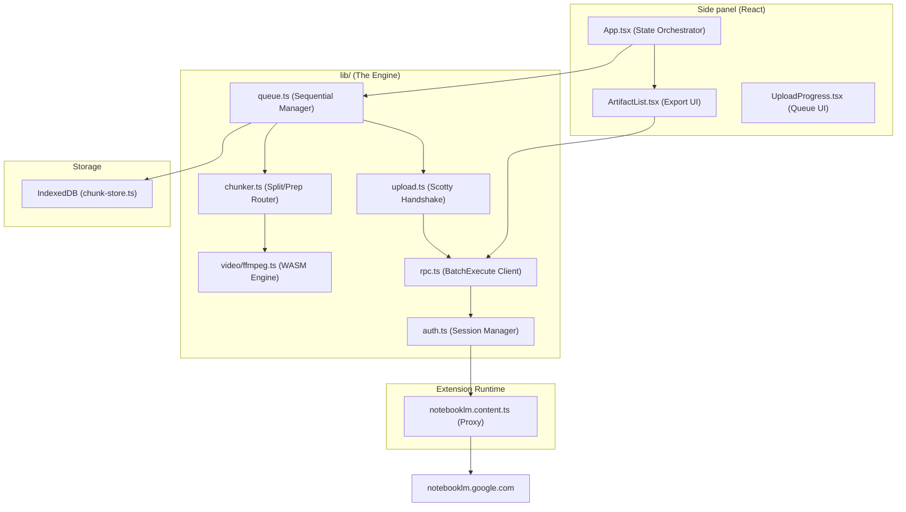

# Learn Flow AI — Architecture & Implementation

This document is the **authoritative source of truth** for developers and AI agents. It details the architecture, technical advantages, and implementation specifics of the Learn Flow AI.    

---

## 1. The Value Proposition: Extension vs. Native NotebookLM

Google NotebookLM is a powerful tool, but it has several technical constraints that this extension autonomously overcomes.

| Feature | Standard NotebookLM | **Learn Flow AI Extension** |
| :--- | :--- | :--- |
| **File Size Limit** | Strictly capped at **200 MB** | **No practical limit** (Successfully tested up to 2GB+) |
| **Oversized Documents** | Upload fails immediately | **Auto-Split:** Documents are byte-sliced into valid <200MB parts |
| **Oversized Videos** | Upload fails immediately | **Local Processing:** Oversized videos are compressed or time-split via FFmpeg.wasm |
| **Upload Reliability** | Browser timeout/crash loses progress | **Resumable Queue:** State is persisted to **IndexedDB**; failed parts can be retried individually |
| **Data Export** | View-only or manual copy-paste | **One-Click Export:** Download Quizzes/Flashcards (MD/JSON), Mind Maps (JSON), and Slide Decks (PPTX) |
| **Privacy** | Standard Google Privacy | **100% Local:** All splitting, compression, and processing happens on your device |

---

## 2. Technical Stack

| Layer | Technology |
| :--- | :--- |
| **Framework** | [WXT (Web Extension Toolbox)](https://wxt.dev) — Manifest V3, Vite-powered |
| **UI Library** | **React 18** + **Tailwind CSS** (NLM-themed aesthetic) |
| **Language** | **TypeScript** (Strict mode) |
| **Video Engine** | **FFmpeg.wasm** (v0.12) with **WORKERFS** for memory efficiency |
| **Persistence** | **IndexedDB** (via `idb` or raw wrapper) for storing prepared Blobs and Job state |
| **Communication** | **Content Script Bridge** for bypassing MV3 HttpOnly cookie restrictions |
| **Protocol** | Reverse-engineered **Google Scotty** (Resumable Upload) & **BatchExecute** (RPC) |

---

## 3. System Architecture & Component Mapping

### 3.1 High-Level Flow

### 3.2 Component Roles

| Module | Responsibility |
| :--- | :--- |
| `queue.ts` | The "Brain." Manages the state machine (Idle -> Preparing -> Uploading -> Done). |
| `chunker.ts` | The "Splitter." Decides if a file needs byte-splitting (PDF/TXT) or media-processing (Video). |
| `tab-proxy.ts` | The "Bypass." Since MV3 side panels can't see Google's HttpOnly cookies, this proxies all traffic through an open NotebookLM tab. |
| `upload.ts` | The "Messenger." Implements the Scotty resumable protocol (Init -> Put Bytes -> Finalize). |
| `source-status.ts` | The "Observer." Polls Google's servers after an upload to ensure the file is *actually* processed and indexed. |

---

## 4. Feature Implementation Details

### 4.1 Document & Video "Mega" Uploads
The extension uses a **parallel chunking strategy**. Unlike simple uploaders, it:
1. **Prepares:** Saves chunks to IndexedDB so a browser crash doesn't waste 20 minutes of video compression.
2. **Registers:** Calls `ADD_SOURCE_FILE` for every part to get a unique Google `sourceId`.
3. **Uploads in Parallel:** Pushes all chunk pieces simultaneously for maximum bandwidth utilization.
4. **Validates & Recovers:** Polls Google's servers for processing status on each individual chunk. If one chunk fails (e.g., due to a timeout or network error), only that specific chunk needs to be retried.

### 4.2 Artifact Export (New)
The extension can "extract" data that Google doesn't provide a download button for by using three undocumented RPCs:
- **`ulBSjf` (GET_ARTIFACT_STATE)**: Used for precise extraction of structured data (Quizzes and Flashcards). It returns the full internal nested tuple state, ensuring we extract exact questions, correct/incorrect answers, and hints.
- **`v9rmvd` (GET_INTERACTIVE_HTML)**: The fallback RPC. Used to extract the raw JSON data block (`data-app-data`) hidden within the rendered HTML of an artifact, or to fetch the raw node tree (e.g., for Mind Maps).
- **`Krh3pd` (EXPORT_ARTIFACT)**: Used specifically for Slide Decks. It triggers NotebookLM to export the deck to Google Slides. The extension then parses the returned Google Drive URL and initiates an automatic native download of the `.pptx` file.
- **Formatting**:
    - **Quizzes:** Converted to structured Markdown (Question/Answer format) or raw JSON.
    - **Flashcards:** Converted to Markdown or raw JSON.
    - **Mind Maps:** Exported as hierarchical JSON trees suitable for visualization tools.
    - **Slide Decks:** Exported and downloaded as native `.pptx` files.

### 4.3 Content Script Bridge (The MV3 Solution)
Chrome Manifest V3 restricts background pages from accessing cookies. We solve this by:
1. Identifying an open `notebooklm.google.com` tab.
2. Injecting `notebooklm.content.ts`.
3. Passing a `NLM_FETCH` message. The content script runs a `fetch()` inside the tab's origin, which **automatically includes the user's secure cookies**.

---

## 5. Security & Privacy
- **No Third-Party Servers:** Your data never leaves the Google ecosystem.
- **Credential Safety:** We do not store your password. We only use the active session "tokens" (`SNlM0e`) already present in your browser.
- **Local Logs:** Debug logs are stored in a local ring-buffer and are never sent to a server.

---

## 6. Critical Pitfalls (Developer Notes)
- **Do NOT byte-slice MP4s:** Slicing an MP4 at a random byte offset breaks the file. Use `ffmpeg.ts` which uses `-c copy -f segment`.
- **The "Stuck" State:** On macOS, Chrome may throttle background tabs. If the connection hangs, the `lib/auth.ts` logic will attempt to focus the tab to "wake it up."
- **Memory Pressure:** Processing a 1GB video requires significant RAM. We use `WORKERFS` to "link" the file to WASM instead of loading the whole 1GB into the JS heap.

---

*Last updated: June 2026. Added: Export features, competitive matrix, and system-wide tech stack analysis.*