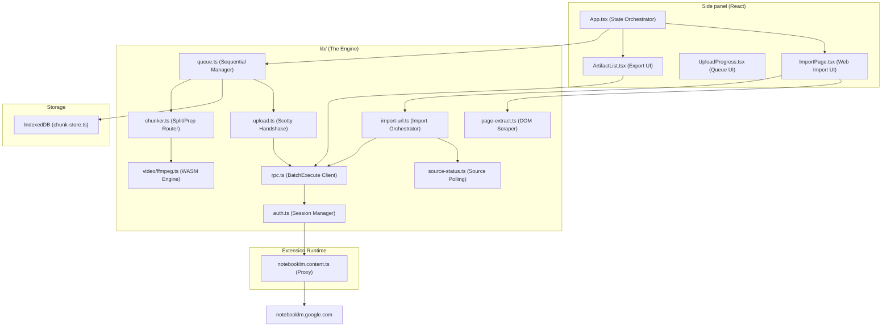
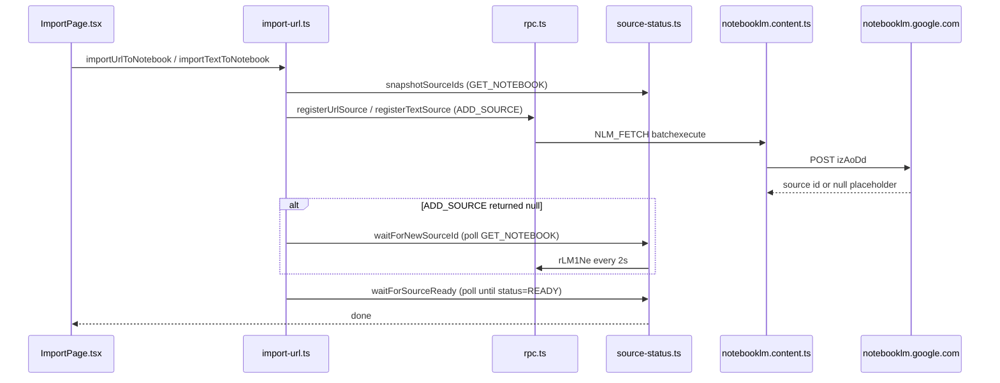

# Learn Flow AI — Architecture & Implementation

This document is the **authoritative source of truth** for developers and AI agents. It details the architecture, technical advantages, and implementation specifics of the Learn Flow AI.    

---

## 1. The Value Proposition: Extension vs. Native NotebookLM

Google NotebookLM is a powerful tool, but it has several technical constraints that this extension autonomously overcomes.

| Feature | Standard NotebookLM | **Learn Flow AI Extension** |
| :--- | :--- | :--- |
| **File Size Limit** | Strictly capped at **200 MB** | **No practical limit** (Successfully tested up to 2GB+) |
| **Oversized Documents** | Upload fails immediately | **Auto-Split:** Documents are byte-sliced into valid <200MB parts |
| **Oversized Videos** | Upload fails immediately | **Local Processing:** Oversized videos are compressed or time-split via FFmpeg.wasm |
| **Upload Reliability** | Browser timeout/crash loses progress | **Resumable Queue:** State is persisted to **IndexedDB**; failed parts can be retried individually |
| **Data Export** | View-only or manual copy-paste | **One-Click Export:** Download Quizzes/Flashcards (MD/JSON), Mind Maps (JSON), and Slide Decks (PPTX) |
| **Web Page Import** | Manual paste in NotebookLM UI | **Import from Side Panel:** Add the current tab as a URL source or scrape visible page text — without leaving the extension |
| **Privacy** | Standard Google Privacy | **100% Local:** All splitting, compression, and processing happens on your device |

---

## 2. Technical Stack

| Layer | Technology |
| :--- | :--- |
| **Framework** | [WXT (Web Extension Toolbox)](https://wxt.dev) — Manifest V3, Vite-powered |
| **UI Library** | **React 18** + **Tailwind CSS** (NLM-themed aesthetic) |
| **Language** | **TypeScript** (Strict mode) |
| **Video Engine** | **FFmpeg.wasm** (v0.12) with **WORKERFS** for memory efficiency |
| **Persistence** | **IndexedDB** (via `idb` or raw wrapper) for storing prepared Blobs and Job state |
| **Communication** | **Content Script Bridge** for bypassing MV3 HttpOnly cookie restrictions |
| **Protocol** | Reverse-engineered **Google Scotty** (Resumable Upload) & **BatchExecute** (RPC) |

---

## 3. System Architecture & Component Mapping

### 3.1 High-Level Flow



### 3.2 Component Roles

| Module | Responsibility |
| :--- | :--- |
| `queue.ts` | The "Brain." Manages the state machine (Idle -> Preparing -> Uploading -> Done). |
| `chunker.ts` | The "Splitter." Decides if a file needs byte-splitting (PDF/TXT) or media-processing (Video). |
| `tab-proxy.ts` | The "Bypass." Since MV3 side panels can't see Google's HttpOnly cookies, this proxies all traffic through an open NotebookLM tab. |
| `upload.ts` | The "Messenger." Implements the Scotty resumable protocol (Init -> Put Bytes -> Finalize). |
| `source-status.ts` | The "Observer." Polls Google's servers after an upload to ensure the file is *actually* processed and indexed. Also powers **web import** source discovery (`GET_NOTEBOOK` polling, URL/title matching, snapshot diff). |
| `import-url.ts` | The "Importer." Orchestrates URL and text source creation: `ADD_SOURCE` → resolve `sourceId` → `waitForSourceReady`. |
| `page-extract.ts` | The "Scraper." Injects a one-shot script into the active tab to read `document.body.innerText` for **Import page text**. |
| `url-import.ts` | The "Gatekeeper." Validates import URLs (scheme, localhost/private IP block, NotebookLM self-import guard, YouTube detection). |
| `active-tab.ts` | The "Tab Reader." Resolves the current window's active tab and requests runtime host permissions for text scraping. |
| `import-session.ts` | The "Handoff." Stores pending context-menu imports in `chrome.storage.session` until the side panel consumes them. |

---

## 4. Feature Implementation Details

### 4.1 Document & Video "Mega" Uploads
The extension uses a **parallel chunking strategy**. Unlike simple uploaders, it:
1. **Prepares:** Saves chunks to IndexedDB so a browser crash doesn't waste 20 minutes of video compression.
2. **Registers:** Calls `ADD_SOURCE_FILE` for every part to get a unique Google `sourceId`.
3. **Uploads in Parallel:** Pushes all chunk pieces simultaneously for maximum bandwidth utilization.
4. **Validates & Recovers:** Polls Google's servers for processing status on each individual chunk. If one chunk fails (e.g., due to a timeout or network error), only that specific chunk needs to be retried.

### 4.2 Artifact Export (New)
The extension can "extract" data that Google doesn't provide a download button for by using three undocumented RPCs:
- **`ulBSjf` (GET_ARTIFACT_STATE)**: Used for precise extraction of structured data (Quizzes and Flashcards). It returns the full internal nested tuple state, ensuring we extract exact questions, correct/incorrect answers, and hints.
- **`v9rmvd` (GET_INTERACTIVE_HTML)**: The fallback RPC. Used to extract the raw JSON data block (`data-app-data`) hidden within the rendered HTML of an artifact, or to fetch the raw node tree (e.g., for Mind Maps).
- **`Krh3pd` (EXPORT_ARTIFACT)**: Used specifically for Slide Decks. It triggers NotebookLM to export the deck to Google Slides. The extension then parses the returned Google Drive URL and initiates an automatic native download of the `.pptx` file.
- **Formatting**:
    - **Quizzes:** Converted to structured Markdown (Question/Answer format) or raw JSON.
    - **Flashcards:** Converted to Markdown or raw JSON.
    - **Mind Maps:** Exported as hierarchical JSON trees suitable for visualization tools.
    - **Slide Decks:** Exported and downloaded as native `.pptx` files.

### 4.3 Content Script Bridge (The MV3 Solution)
Chrome Manifest V3 restricts background pages from accessing cookies. We solve this by:
1. Identifying an open `notebooklm.google.com` tab.
2. Injecting `notebooklm.content.ts`.
3. Passing a `NLM_FETCH` message. The content script runs a `fetch()` inside the tab's origin, which **automatically includes the user's secure cookies**.

All import RPCs (`ADD_SOURCE`, `GET_NOTEBOOK`) use the same **tab-proxy** path as uploads — no separate auth channel.

### 4.4 Web Page Import (URL & Text Sources)

The extension can add **web pages as NotebookLM sources** from the side panel without using NotebookLM's built-in "Website" dialog. Two complementary modes are supported:

| Mode | What it does | Who fetches content |
| :--- | :--- | :--- |
| **Import URL** | Registers a public `http(s)://` link as a source | **Google** (server-side fetch via NotebookLM) |
| **Import page text** | Scrapes visible text from the active browser tab | **Extension** (local DOM read, then sent as a text source) |

#### 4.4.1 User Entry Points

1. **Side panel (`ImportPage.tsx`)** — Wired into `App.tsx`. Shows the active tab URL/title, optional manual URL field, and two actions: *Import URL* / *Import page text*.
2. **Context menu (`background.ts`)** — Right-click any page or link → **Import to NotebookLM**. Stores `{ url, title, tabId }` in `chrome.storage.session` via `import-session.ts`, opens the side panel, and notifies the UI with `PENDING_PAGE_IMPORT`.

#### 4.4.2 Import Flow (End-to-End)



**Phases shown in the UI:** `registering` → `processing` → `done` (or `error`).

#### 4.4.3 NotebookLM RPCs Used

| RPC ID | Constant | Role in import |
| :--- | :--- | :--- |
| `izAoDd` | `ADD_SOURCE` | Register a URL, YouTube URL, or pasted text as a new source |
| `rLM1Ne` | `GET_NOTEBOOK` | List notebook sources; poll for new source appearance and processing status |

Implementation is aligned with the open-source **[notebooklm-py](https://github.com/teng-lin/notebooklm-py)** client and golden RPC fixtures under `notebooklm-py/tests/fixtures/rpc_golden/`.

**`ADD_SOURCE` payload shapes (`lib/rpc.ts` → `buildUrlSourceParams`):**

- **Standard URL** (notebooklm-py production format — tried first):
  ```text
  [[null, null, [url], null, null, null, null, null]], notebookId, [2], null, null
  ```
- **URL with title** (UI / golden-fixture fallback):
  ```text
  [[[url]], title], notebookId, [2]
  ```
- **YouTube** (URL at metadata slot `[7]` in an 11-element array):
  ```text
  [[null, …, [url], null, null, 1]], notebookId, [2], [1, …, [1]]
  ```
- **Pasted text** (`registerTextSource`):
  ```text
  [[null, [title, content], null, …]], notebookId, [2], null, null
  ```

`registerUrlSource` tries multiple shapes in sequence. If a shape is **rejected** (e.g. `INVALID_ARGUMENT`), the error is caught and the next shape is attempted. If a shape is **accepted** but returns `null` (async placeholder), polling begins.

> **Critical nesting rule:** Payload arrays use a **single** outer wrap (`[[slots]]`), not double (`[[[slots]]]`). An extra nesting level causes silent server rejection.

#### 4.4.4 Async `ADD_SOURCE` & Source ID Resolution

NotebookLM often returns `null` from `ADD_SOURCE` even when the source is being created asynchronously. The extension handles this in layers:

1. **`decoder.ts`** — `decodeResponse(..., { allowNull: true })` accepts null placeholders but still throws on gRPC error statuses (e.g. status `3` = `INVALID_ARGUMENT`).
2. **`extractAddSourceId` / `extractIdFromRow`** — Parse nested ID envelopes from responses and `GET_NOTEBOOK` rows (e.g. `row[0][0][0]` → `"uuid"`).
3. **`snapshotSourceIds`** — Before calling `ADD_SOURCE`, snapshot existing source IDs via `GET_NOTEBOOK`.
4. **`waitForNewSourceId`** — Poll every 2s (up to 90s) until:
   - **Case A:** A source ID not in the snapshot appears (async add succeeded), or
   - **Case B:** An existing source matches the URL/title (duplicate add — server returned null without creating a duplicate).
5. **`waitForSourceReady`** — Reuses the upload observer to poll until `source[3][1]` is `READY` (2).

URL matching uses normalized URLs (`normalizeImportUrl`, `urlsRoughlyMatch`) and walks the entire source row for embedded URLs (`collectUrlsFromMetadata`).

#### 4.4.5 Import Page Text — Local DOM Scraping

When the user chooses **Import page text**:

1. **`ensureHostAccess(pageUrl)`** (`active-tab.ts`) — Requests `chrome.permissions.request({ origins: ['https://*/*'] })` (or `http://*/*`) **as the first async call inside the click handler**, so Chrome treats it as a user gesture. The pattern must **exactly match** `optional_host_permissions` in the manifest.
2. **`extractPageContent(tabId)`** (`page-extract.ts`) — `chrome.scripting.executeScript` clones `document.body`, strips `script/style/noscript/svg`, and returns `innerText`. Content is capped at `MAX_TEXT_SOURCE_CHARS` (500,000).
3. **`importTextToNotebook`** — Sends scraped title + body via `ADD_SOURCE` text params, then polls for the source by title if the RPC returns null.

#### 4.4.6 Permissions & Security

| Permission | Purpose |
| :--- | :--- |
| `tabs` | Read active tab URL/title for import UI |
| `activeTab` | Transient access when user invokes the extension |
| `scripting` | Inject the text-extraction function into the page tab |
| `contextMenus` | "Import to NotebookLM" right-click action |
| `host_permissions` (`*.google.com`) | NotebookLM tab-proxy RPCs |
| `optional_host_permissions` (`http://*/*`, `https://*/*`) | Runtime grant for scraping arbitrary sites (text import only) |

**URL validation (`url-import.ts`):** Only `http://` and `https://` are allowed. Blocked: `chrome://`, `file://`, localhost, private IPs, and NotebookLM URLs (cannot import itself).

#### 4.4.7 Key Files

| File | Responsibility |
| :--- | :--- |
| `components/ImportPage.tsx` | React UI, phase state, context-menu handoff |
| `lib/import-url.ts` | `importUrlToNotebook`, `importTextToNotebook` orchestration |
| `lib/rpc.ts` | `registerUrlSource`, `registerTextSource`, `buildUrlSourceParams` |
| `lib/source-status.ts` | `snapshotSourceIds`, `waitForNewSourceId`, `waitForSourceReady` |
| `lib/page-extract.ts` | DOM text extraction |
| `lib/active-tab.ts` | `getActiveTab`, `ensureHostAccess` |
| `lib/url-import.ts` | URL validation, YouTube detection |
| `lib/import-session.ts` | Context-menu → side panel session storage |
| `lib/user-errors.ts` | User-facing import error messages |
| `entrypoints/background.ts` | Context menu registration and click handler |

---

## 5. Security & Privacy
- **No Third-Party Servers:** Your data never leaves the Google ecosystem.
- **Credential Safety:** We do not store your password. We only use the active session "tokens" (`SNlM0e`) already present in your browser.
- **Local Logs:** Debug logs are stored in a local ring-buffer and are never sent to a server.

Full details: [SECURITY.md](SECURITY.md) (pillars, threat model, Q&A, known limitations).

---

## 6. Critical Pitfalls (Developer Notes)
- **Do NOT byte-slice MP4s:** Slicing an MP4 at a random byte offset breaks the file. Use `ffmpeg.ts` which uses `-c copy -f segment`.
- **The "Stuck" State:** On macOS, Chrome may throttle background tabs. If the connection hangs, the `lib/auth.ts` logic will attempt to focus the tab to "wake it up."
- **Memory Pressure:** Processing a 1GB video requires significant RAM. We use `WORKERFS` to "link" the file to WASM instead of loading the whole 1GB into the JS heap.
- **ADD_SOURCE nesting:** URL/text payloads must match notebooklm-py wire shapes exactly. An extra `[[` wrapper causes null rejection.
- **Import permissions:** After adding `optional_host_permissions`, users must **Remove + Load unpacked** (not just reload) so Chrome registers the new manifest entries. Text import requests `https://*/*` at click time — sub-patterns like `https://example.com/*` are rejected by Chrome.
- **Async null is not failure:** A null `ADD_SOURCE` response with no error status means "accepted, processing" — always poll `GET_NOTEBOOK` before giving up.

---

*Last updated: June 2026. Added: Web page import (URL + text sources), export features, competitive matrix, and system-wide tech stack analysis.*