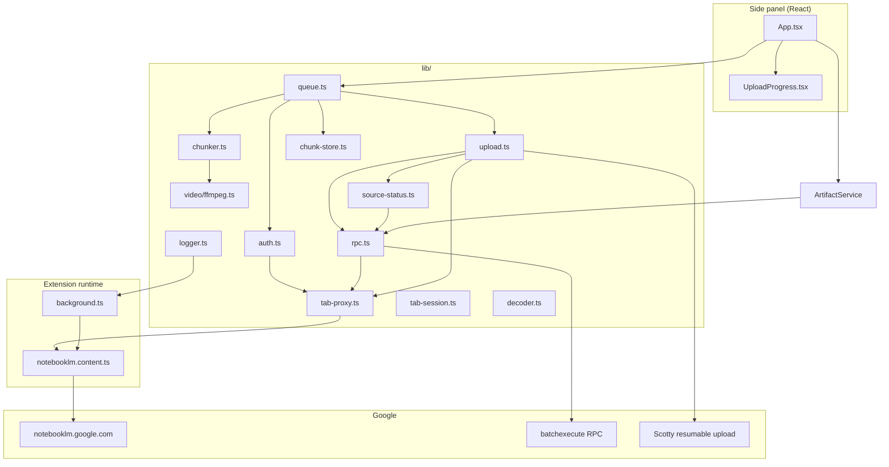
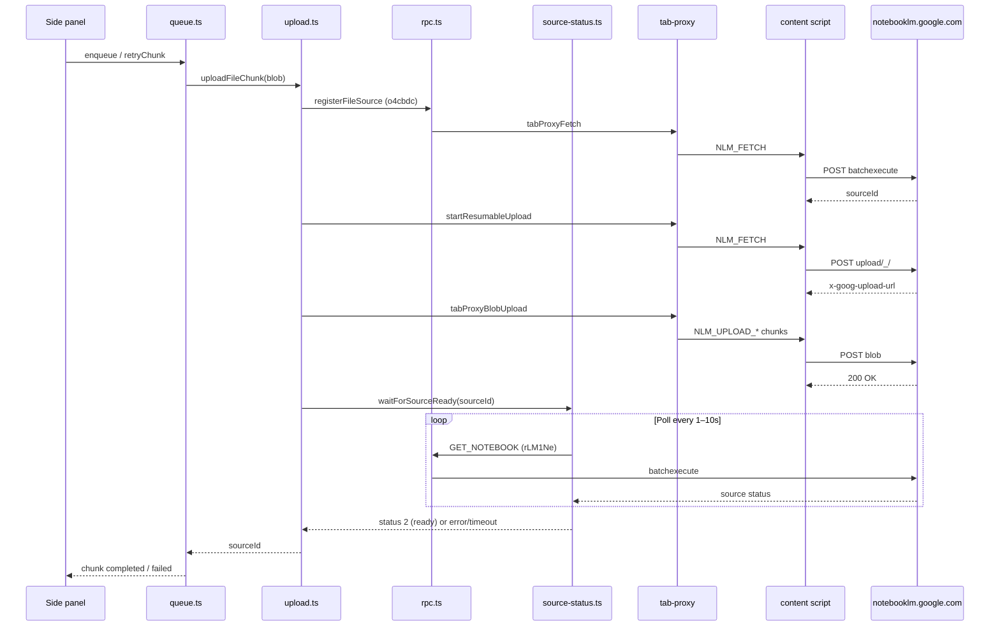

# NotebookLM Mega Uploader — Implementation Context

This document is an **onboarding guide for developers and AI agents**. It explains what the extension does, how it is structured, critical design decisions, and the full upload/retry lifecycle as implemented today.

**Related codebases:**
- [`notebooklm-py`](../notebooklm-py) — Python reference for RPC payloads, response decoding, and source-status semantics
- [`notebooklm-uploader`](../notebooklm-uploader) — CLI uploader (different chunking strategy)

---

## 1. What this project is

A **Chrome Manifest V3 extension** (WXT + React 18 + Tailwind) that uploads large local files to **Google NotebookLM** in parts under **200 MB**.

| Constraint | Value |
|------------|-------|
| NotebookLM per-source limit | ~200 MB |
| `MAX_CHUNK_BYTES` | `200 * 1024 * 1024 - 1` (strictly below 200 MB) |
| Max input file | 2 GB (browser memory) |
| Warn threshold | 1 GB |

**Privacy:** All file processing (split/compress) runs locally in the browser. Network traffic goes only to official `notebooklm.google.com` endpoints.

**No API keys / `.env`:** Auth reuses the user's Google session from an open NotebookLM tab.

---

## 2. High-level architecture



### Why a content-script bridge exists

Chrome **MV3 side panels cannot read HttpOnly session cookies** reliably for cross-origin API calls. The extension therefore:

1. Finds an open `notebooklm.google.com` tab
2. Injects / uses a **content script** (`notebooklm.content.ts`) as a proxy
3. Proxies `fetch` and large **blob uploads** from that tab's origin (cookies attached automatically)

Session tokens (`SNlM0e` CSRF, `FdrFJe` session id) are read from the tab's HTML via `WIZ_global_data` parsing (`lib/wiz.ts`, `lib/tab-session.ts`).

---

## 3. Extension entrypoints

| File | Role |
|------|------|
| `entrypoints/background.ts` | Opens side panel on icon click; ensures content-script bridge on NotebookLM tabs; mirrors logs to service worker console |
| `entrypoints/notebooklm.content.ts` | Runs on NotebookLM pages; handles `NLM_PING`, `NLM_GET_SESSION`, `NLM_FETCH`, `NLM_UPLOAD_*` messages |
| `entrypoints/sidepanel/App.tsx` | Main React UI: connect, notebook select, file pick, upload, retry, done |
| `entrypoints/sidepanel/main.tsx` | React mount |

### Content-script message types

| Message | Purpose |
|---------|---------|
| `NLM_PING` | Bridge health check |
| `NLM_GET_SESSION` | Extract CSRF + session id from page HTML |
| `NLM_FETCH` | Proxy small API requests (RPC batchexecute) with `credentials: 'include'` |
| `NLM_UPLOAD_INIT` / `NLM_UPLOAD_CHUNK` / `NLM_UPLOAD_FINALIZE` | Stream large blobs to upload URL in 8 MB Chrome message chunks |

---

## 4. End-to-end upload flow

### 4.1 User journey (UI)

```
Connect → Select notebook → Drop file → [Video prep dialog if >200MB] → Start Upload
  → Preparing (split/compress) → Uploading parts sequentially
  → Per-part: upload bytes → poll NotebookLM processing
  → Summary (done phase) → Retry failed parts one-at-a-time OR Done (clears local storage)
```

### 4.2 Orchestration (`lib/queue.ts`)

`SequentialUploadQueue` is a **singleton** (`uploadQueue`). It:

1. **`enqueue(file, notebookId, onProgress, options)`**
   - Optionally prepares video via `prepareFileChunks`
   - Saves prepared blobs to **IndexedDB** (`chunk-store.ts`)
   - Uploads parts **one at a time** (Part 2 waits for Part 1 to fully succeed)
   - Sets `job.phase` through: `preparing` → `uploading` → `done`

2. **`retryChunk(job, chunkIndex, onProgress)`**
   - **Only one retry at a time**
   - Sets `job.phase = 'retrying'` and `job.retryingChunkIndex`
   - Re-uploads + re-polls processing for that single part
   - Returns to `job.phase = 'done'` when finished (success or fail)

3. **`cancel()`** — aborts in-flight work, calls `terminateFfmpeg()`

4. **`clearPreparedChunks(jobId?)`** — clears memory + deletes IndexedDB job

### 4.3 Per-chunk pipeline (`lib/upload.ts`)

For each part:

```
registerFileSource()     → RPC o4cbdc → sourceId (UUID)
startResumableUpload()   → POST upload/_/ → x-goog-upload-url
uploadBlobResumable()    → POST blob to Scotty URL → HTTP 200
waitForSourceReady()     → poll GET_NOTEBOOK → status 2 = truly done
```

**Important:** HTTP 200 on Scotty upload only means **bytes stored**. NotebookLM may still fail transcoding/indexing. That is why `waitForSourceReady` exists.

### 4.4 Post-upload processing (`lib/source-status.ts`)

Polls `GET_NOTEBOOK` RPC (`rLM1Ne`) with params:

```ts
[notebookId, null, [2], null, 0]
```

Sources list is at `response[0][1]`. Per-source status is at `source[3][1]`:

| Code | Meaning |
|------|---------|
| `1` | Processing |
| `2` | Ready (success) |
| `3` | Error (failed) |
| `5` | Preparing |

Default timeout: **180 seconds** (`SOURCE_PROCESSING_TIMEOUT_MS`).

Media sources (type code `10`) may briefly report status `3` during transcription; those are treated as **transient** and polling continues (ported from `notebooklm-py`).

---

## 5. File preparation (`lib/chunker.ts` + `lib/video/ffmpeg.ts`)

### Documents (PDF, TXT, MD)

- **Byte-split** with `Blob.slice()` if `file.size > MAX_CHUNK_BYTES`
- Parts named `basename_Part1.ext`, `basename_Part2.ext`, …
- Each part is a valid slice of the original file

### Videos (MP4, WebM, MOV, MKV)

- **Never byte-split** — middle segments would lack `moov` atom and be invalid MP4s
- If `file.size > MAX_CHUNK_BYTES`, user must choose:
  - **`split`** — FFmpeg **stream copy** segment (`-c copy -f segment`) into valid MP4 parts
  - **`compress`** — FFmpeg re-encode to fit under 200 MB in one file

### FFmpeg implementation notes (`lib/video/ffmpeg.ts`)

| Topic | Decision |
|-------|----------|
| Runtime | `@ffmpeg/ffmpeg` WASM, cores in `public/ffmpeg/` (copied on `npm install`) |
| Large files | **WORKERFS** mount to avoid copying 600+ MB into WASM heap |
| Split method | Stream-copy segments only (removed broken byte-slice `splitMp4Fast`) |
| Target split size | `TARGET_SPLIT_BYTES` = 100 MB (conservative; keyframes can overshoot) |
| Cancel | `terminateFfmpeg()` + `execWithAbort()` kills WASM worker on abort |
| CSP | `wasm-unsafe-eval` in `wxt.config.ts` |

Exported functions: `probeVideo`, `splitVideo`, `compressVideo`, `terminateFfmpeg`.

---

## 6. Authentication (`lib/auth.ts`)

`fetchAuthSession()` returns `AuthSession`:

```ts
{
  csrfToken, sessionId, authuser?,
  cookieHeader,  // fallback when no tab proxy
  tabId?,        // preferred path: proxy via content script
}
```

**Tab-first model:** Prefer `tabId` from an open NotebookLM tab. Cookie header path exists as fallback but tab proxy is the reliable production path.

Diagnostics: `getAuthDiagnostics()` — human-readable cookie/session state for error UI.

---

## 7. RPC layer (`lib/rpc.ts` + `lib/decoder.ts`)

### Endpoints

| Constant | URL / ID |
|----------|----------|
| `BATCHEXECUTE_URL` | `https://notebooklm.google.com/_/LabsTailwindUi/data/batchexecute` |
| `UPLOAD_URL` | `https://notebooklm.google.com/upload/_/` |
| `LIST_NOTEBOOKS` | `wXbhsf` |
| `GET_NOTEBOOK` | `rLM1Ne` |
| `ADD_SOURCE_FILE` | `o4cbdc` |
| `UPDATE_SOURCE` | `b7Wfje` (defined, not used in upload flow yet) |

### Request shape

```ts
f.req = JSON.stringify([[[rpcId, JSON.stringify(params), null, 'generic']]])
at = csrfToken
```

`source-path` query param set to `/notebook/{notebookId}` for notebook-scoped RPCs.

### Response decoding

`decoder.ts` strips anti-XSSI prefix `)]}'`, parses chunked JSON lines, extracts `wrb.fr` results by RPC id. `RpcError` on `er` tags or missing results.

---

## 8. State model (`lib/types.ts`)

### Job phases (`JobPhase`)

| Phase | Meaning |
|-------|---------|
| `idle` | No active work |
| `preparing` | FFmpeg split/compress running |
| `uploading` | Initial sequential upload of all parts |
| `retrying` | Single failed part being retried |
| `done` | Summary screen; user must click Done before new upload |

### Chunk statuses (`ChunkStatus`)

| Status | Meaning |
|--------|---------|
| `pending` | Not started |
| `uploading` | Bytes going to Scotty |
| `processing` | Bytes uploaded; polling NotebookLM |
| `completed` | NotebookLM reported ready (status 2) |
| `failed` | Upload error, processing error, timeout, or cancel |

### `UploadJob` key fields

- `chunks: ChunkProgress[]` — per-part UI state
- `retryingChunkIndex?` — which part is active during `retrying` phase
- `sourceId?` on each chunk — UUID from `ADD_SOURCE_FILE`

---

## 9. Local persistence (`lib/chunk-store.ts`)

**IndexedDB** database `nlm-mega-uploader`:

| Store | Contents |
|-------|----------|
| `jobMeta` | Job id, notebook, chunk statuses, phase, `retryingChunkIndex`, `updatedAt` |
| `chunks` | Prepared `Blob` per part (key: `[jobId, index]`) |

### Why it exists

Splitting a 600 MB video takes minutes. Users may close the side panel or need to retry failed parts later. Prepared blobs stay on disk until **Done**.

### Interrupted retry recovery

`normalizeStoredJob()` — if a job was saved mid-`retrying` (panel closed), the in-progress part is reset to `failed` with message *"Retry interrupted — click Retry this part again"* so retry buttons work on restore.

`App.tsx` calls `getLatestStoredJob()` on mount and hydrates `uploadQueue` + UI.

---

## 10. UI components

| Component | Role |
|-----------|------|
| `App.tsx` | Wires queue, auth, restore, retry handlers |
| `UploadProgress.tsx` | Prep bar, per-part status colors, summary, per-part **Retry this part**, Done |
| `VideoPrepDialog.tsx` | Compress vs Split choice |
| `FileDropZone.tsx` | Drag/drop file picker |
| `NotebookSelect.tsx` | Notebook dropdown + refresh |

### Retry UX rules

- **One part at a time** — no bulk "retry all" button
- During `retrying`: all retry buttons hidden, Done disabled, active part shows uploading/processing
- On failure: **Retry this part** reappears for that part only
- `busy` flag in App prevents double-clicks

### Progress display

- **Prep:** `job.prepProgress.percent` on amber bar
- **Upload:** byte-weighted `computeUploadPercent(job)` across chunks
- **Processing:** chunk status `processing` (amber, full bar width)

---

## 11. Logging (`lib/logger.ts`)

- Prefix: `[NLM:scope]` (scopes: `ui`, `auth`, `rpc`, `upload`, `queue`, `ffmpeg`, `chunk-store`, `source-status`, …)
- Ring buffer (~250 entries); `copyRecentLogsToClipboard()` for user bug reports
- Secrets redacted (CSRF, session ids, cookies)
- Mirrored to service worker via `NLM_LOG_MIRROR` message
- Verbose: `localStorage.setItem('nlm-debug', '1')` in side panel console

**Logs appear in:** side panel DevTools (right-click panel → Inspect), NOT `npm run dev` terminal.

---

## 12. Critical pitfalls (read before changing code)

### 1. Do not byte-split video

Only FFmpeg container-aware split produces valid parts 2..N.

### 2. HTTP 200 ≠ NotebookLM success

Always use `waitForSourceReady` after upload unless you intentionally only want storage confirmation.

### 3. Tab must stay open

Upload/RPC proxy requires a live NotebookLM tab in the same Chrome profile.

### 4. Memory pressure

Prepared parts exist in RAM **and** IndexedDB during a job. A 600 MB split ≈ 600 MB+ disk until Done.

### 5. Sequential uploads are intentional

NotebookLM and UX are simpler when parts upload in order. Do not parallelize without understanding server limits.

### 6. `env.d.ts` vs `@types/chrome`

Project uses a **minimal** `chrome` namespace stub in `env.d.ts`. If adding Chrome APIs, extend the stub (e.g. `removeListener` was added for `onMessage`).

### 7. FFmpeg load time

First WASM load is 20–40 s; UI shows explicit progress. Cancel must terminate worker or upload hangs.

---

## 13. Module file reference

```
notebooklm-mega-uploader/
├── entrypoints/
│   ├── background.ts           # Service worker
│   ├── notebooklm.content.ts   # Tab proxy bridge
│   └── sidepanel/
│       ├── App.tsx             # Main UI controller
│       └── main.tsx
├── components/
│   ├── FileDropZone.tsx
│   ├── NotebookSelect.tsx
│   ├── UploadProgress.tsx
│   └── VideoPrepDialog.tsx
├── lib/
│   ├── auth.ts                 # Session acquisition
│   ├── chunk-store.ts          # IndexedDB persistence
│   ├── chunker.ts              # Document split + video prep routing
│   ├── constants.ts            # Limits, RPC ids, MIME map
│   ├── decoder.ts              # batchexecute response parser
│   ├── logger.ts               # Structured logging
│   ├── queue.ts                # Upload orchestration + retry
│   ├── rpc.ts                  # batchexecute client
│   ├── source-status.ts        # GET_NOTEBOOK polling
│   ├── tab-proxy.ts            # Content-script RPC/upload proxy
│   ├── tab-session.ts          # Read session from tab HTML
│   ├── types.ts                # Shared TypeScript types
│   ├── upload.ts               # Scotty resumable upload
│   ├── wiz.ts                  # WIZ_global_data field extraction
│   └── video/
│       └── ffmpeg.ts           # WASM split/compress
├── env.d.ts                    # Minimal Chrome + WXT types
├── wxt.config.ts               # MV3 manifest, CSP, FFmpeg paths
└── public/ffmpeg/              # Generated WASM binaries (gitignored)
```

---

## 14. Sequence diagram: single part upload



---

## 15. Implementation history (what was built & why)

This section summarizes major work iterations so agents understand **why** the code looks the way it does.

| Problem | Solution |
|---------|----------|
| Extension couldn't auth in MV3 | Tab-first auth + content script bridge; read `WIZ_global_data` from open NotebookLM tab |
| Upload stuck / only Part 1 worked | Removed byte-slice video split; FFmpeg stream-copy only; WORKERFS for large files |
| FFmpeg hang on 600+ MB | Removed remux-to-memory step; mount input via WORKERFS |
| Cancel didn't stop split | `terminateFfmpeg()` + abort listeners on exec/load |
| HTTP 200 but NotebookLM UI shows error | Added `source-status.ts` polling after each upload |
| One failed part stopped others | Per-chunk try/catch in queue; continue remaining parts |
| User wanted retry without re-split | Keep `preparedChunks` in memory + IndexedDB until Done |
| Bulk retry confusing | Single-part retry only; `retrying` phase; buttons disabled until complete |
| Panel reload lost job | `getLatestStoredJob()` on App mount + `normalizeStoredJob()` for interrupted retries |
| Debugging hard | `logger.ts` with scopes, ring buffer, clipboard export, SW mirror |

---

## 16. Common tasks for AI agents

### Add a new file type

1. Add extension to `SUPPORTED_EXTENSIONS` and `MIME_BY_EXTENSION` in `constants.ts`
2. If not video: `chunkDocument` handles byte-split automatically
3. If video-like: add to `VIDEO_EXTENSIONS` and ensure FFmpeg split path outputs valid container

### Change chunk size limit

Update `MAX_CHUNK_BYTES`, `TARGET_CHUNK_BYTES`, `TARGET_SPLIT_BYTES` in `constants.ts`. Test both Scotty upload and NotebookLM processing.

### Add new RPC

1. Add method id to `RPC_METHODS` in `constants.ts`
2. Add function in `rpc.ts` using `rpcCall`
3. Decode with `decoder.ts`; reference `notebooklm-py` for payload shapes

### Improve split quality

Consider keyframe-aligned segment times in `ffmpeg.ts` (`-force_key_frames` or segment at keyframes) to reduce NotebookLM processing failures on middle segments.

### Extend persistence

`chunk-store.ts` schema is version 1. Bump `DB_VERSION` with migration in `onupgradeneeded` if adding fields.

---

## 17. Build & dev commands

```bash
npm install          # postinstall: wxt prepare + copy ffmpeg wasm
npm run dev          # watch build → .output/chrome-mv3-dev
npm run build        # production → .output/chrome-mv3
npm run zip          # distributable
```

Load unpacked extension from `.output/chrome-mv3-dev` in **normal Chrome** (where Google is signed in). WXT auto-opened browser uses a separate profile by default.

---

## 18. Glossary

| Term | Meaning |
|------|---------|
| **Scotty** | Google's resumable upload protocol (`x-goog-upload-*` headers) |
| **batchexecute** | Google's batch RPC endpoint used by NotebookLM web app |
| **sourceId** | UUID identifying an uploaded source in a notebook |
| **moov atom** | MP4 metadata atom; required for playback/processing; why byte-split fails |
| **WORKERFS** | FFmpeg.wasm filesystem that references browser File without full memory copy |
| **WIZ_global_data** | Inline JSON blob in NotebookLM HTML with CSRF/session fields |

---

## 19. Artifact Export

The extension allows exporting NotebookLM artifacts (Quizzes, Flashcards, and Mind Maps) in various formats.

### Core Logic (`lib/artifacts.ts`)

- **Quiz/Flashcards:** Fetches interactive HTML via RPC `v9rmvd`, extracts JSON from `data-app-data` attribute, and formats it into Markdown or JSON.
- **Mind Map:** Fetches interactive tree via RPC `v9rmvd` (response index `[0][9][3]`) and exports as hierarchical JSON.

### UI Integration

- **`components/ArtifactList.tsx`**: Lists exportable artifacts for the active notebook.
- **Tabbed View:** `App.tsx` features an **Export** tab to access the artifact list separately from the upload queue.

---

*Last updated to reflect: artifact export (quiz, flashcards, mind map), post-upload processing poll, IndexedDB persistence, single-part retry flow, and tab-proxy architecture.*
