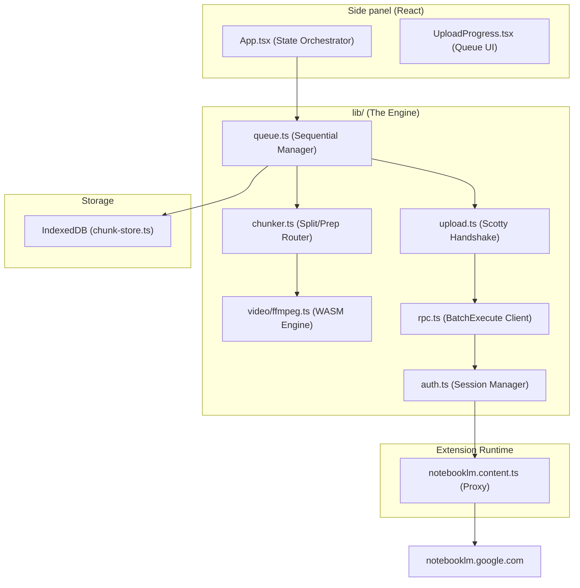

# NotebookLM Mega Uploader — Reverse Engineering & Architecture Report

This document is an exhaustive reconstruction of the implementation details, execution flows, and architectural decisions of the NotebookLM Mega Uploader extension, derived directly from source code analysis.

---

## 1. Overall Architecture

### 1.1 High-Level Purpose
The NotebookLM Mega Uploader is a Manifest V3 browser extension built to bypass Google NotebookLM's strict 200MB file limit. It processes, chunks (via byte-slicing or FFmpeg), and concurrently uploads local files directly to Google's Scotty resumable endpoints using the user's active session.

### 1.2 File Locations
- **Extension Entry:** `entrypoints/background.ts`, `entrypoints/sidepanel/App.tsx`, `entrypoints/notebooklm.content.ts`
- **Core Engine:** `lib/queue.ts`, `lib/upload.ts`, `lib/rpc.ts`, `lib/chunker.ts`, `lib/auth.ts`, `lib/tab-proxy.ts`
- **Web Workers:** `lib/video/ffmpeg.ts`
- **Persistence:** `lib/chunk-store.ts` (IndexedDB)

### 1.3 Execution Flow
1.  **User Interaction:** The user interacts with the React Side Panel (`App.tsx`), selecting a notebook and files.
2.  **Session Acquisition:** The extension searches for an open `notebooklm.google.com` tab. It extracts the `WIZ_global_data` (CSRF/Session ID) directly from the tab's HTML/MAIN world (`lib/tab-session.ts`, `lib/wiz.ts`).
3.  **Chunking Engine:** Large files are sent to `lib/chunker.ts`. Documents are byte-sliced; videos are processed via FFmpeg.wasm.
4.  **Queue & Persistence:** Prepared chunks and job metadata are pushed to an IndexedDB store (`lib/chunk-store.ts`).
5.  **Parallel Uploads:** `lib/queue.ts` iterates over chunks, running them through a concurrent semaphore of up to 3 threads.
6.  **Network Proxy:** Requests are forwarded to the Content Script (`notebooklm.content.ts`), which runs `fetch()` in the NotebookLM tab origin to include cookies.
7.  **Polling:** Once bytes are uploaded, `lib/source-status.ts` polls `batchexecute` (GET_NOTEBOOK) until Google flags the chunk as READY (Status 2).

### 1.4 System Diagram

---

## 2. Browser Extension Implementation

### 2.1 Component Mapping
- **Manifest:** Version 3 (`wxt.config.ts`).
- **Background Script (`entrypoints/background.ts`):** 
    - Manages the side panel opening.
    - Ensures the content script bridge is injected into NotebookLM tabs.
    - Mirrors logs to the service worker console.
- **Content Script (`entrypoints/notebooklm.content.ts`):** 
    - Proxies `fetch` and large blob uploads from the tab's origin (attaches cookies automatically).
    - Handles `NLM_FETCH`, `NLM_UPLOAD_INIT`, `NLM_UPLOAD_CHUNK`, and `NLM_UPLOAD_FINALIZE` messages.
- **Side Panel (`entrypoints/sidepanel/App.tsx`):** 
    - Main React UI for connecting, picking files, and managing the upload queue.

---

## 3. RPC Architecture & Reverse Engineering

### 3.1 Overview & Methodology
The extension uses a reverse-engineered implementation of Google's `batchexecute` protocol. This protocol was identified by monitoring **Network Traffic** in the browser's developer tools while using the official NotebookLM site. By capturing the `rpcid` values and JSON structures, the extension can "mimic" the official web client.

### 3.2 Technical Definitions
- **RPC (Remote Procedure Call):** A protocol that allows a program to execute a function or procedure in another address space (commonly on a remote server) as if it were a local function call.
- **batchexecute:** Google's internal endpoint for sending multiple RPCs in a single HTTP POST request.
- **Anti-XSSI Prefix:** A security string (`)]}'`) prepended to JSON responses by Google to prevent "JSON Hijacking" or Cross-Site Script Inclusion (XSSI).
- **Nested Tuples:** A data structure where arrays are placed inside other arrays, used by Google to represent complex state machines (e.g., Quiz answers and Mind Map nodes).

### 3.3 Request Lifecycle
1.  **Encode:** `rpc.ts` wraps parameters into a multi-dimensional array matrix.
2.  **CSRF Protection:** The `at` (Action Token) is extracted from the session to validate the request.
3.  **Proxy:** `tab-proxy.ts` sends the request to the content script.
4.  **Execute:** Content script executes `fetch` against `BATCHEXECUTE_URL`.
5.  **Decode:** `decoder.ts` strips the anti-XSSI prefix, parses the chunked data, and identifies the block matching the `rpcId`.

### 3.4 RPC Reference Table
| RPC ID | Name | Purpose | Logic |
| :--- | :--- | :--- | :--- |
| **`wXbhsf`** | `LIST_NOTEBOOKS` | Fetch Workspaces | Populates the initial notebook selector. |
| **`o4cbdc`** | `ADD_SOURCE_FILE` | Source Registration | Called before upload to generate a server-side `sourceId`. |
| **`rLM1Ne`** | `GET_NOTEBOOK` | Status Polling | Returns a status code (1=Processing, 2=Ready, 3=Error). |
| **`v9rmvd`** | `GET_INTERACTIVE_HTML` | Artifact Data | Fetches raw HTML containing JSON blocks for Mind Maps. |
| **`ulBSjf`** | `GET_ARTIFACT_STATE` | Quiz/Flashcard State | Extracts questions and answers for structured export. |

---

## 4. Video Upload Pipeline

### 4.1 Step-by-Step Flow
1.  **Selection:** User drops a video file.
2.  **Validation:** `chunker.ts` checks if the file exceeds `MAX_CHUNK_BYTES`.
3.  **Prep Dialog:** User chooses 'Split' or 'Compress'.
4.  **FFmpeg Processing:** `lib/video/ffmpeg.ts` runs.
    -   **Split:** Uses `-c copy -f segment` to create valid MP4 parts.
    -   **Compress:** Re-encodes using `libx264` to fit under 200MB.
5.  **Persistence:** Prepared blobs are saved to IndexedDB (`chunk-store.ts`).
6.  **Sequential/Parallel Upload:** 
    -   Register source via `ADD_SOURCE_FILE` RPC.
    -   Start resumable upload via Scotty handshake (`startResumableUpload`).
    -   Upload bytes via `uploadBlobResumable` (proxied through the tab).
7.  **Polling:** `waitForSourceReady` polls `GET_NOTEBOOK` until status is `2` (Ready).

---

## 5. Document Upload Pipeline

### 5.1 Overview
Documents (PDF, TXT, MD) follow a simpler path than video as they can be byte-sliced without breaking the file format.

### 5.2 Flow
1.  **Byte-Slicing:** `chunkDocument` in `chunker.ts` slices the file using `Blob.slice()`.
2.  **Upload:** Each part is uploaded sequentially or in parallel using the same Scotty protocol as videos.
3.  **Polling:** Each part is polled for processing completion.

---

## 6. Chunking / Splitting Logic

### 6.1 Implementations
- **Documents:** `lib/chunker.ts` -> `chunkDocument`. Basic byte offset slicing using `Blob.slice()`.
- **Videos:** `lib/video/ffmpeg.ts` -> `splitVideo`. Uses FFmpeg.wasm for container-aware segmentation.

### 6.2 Video Splitting Deep Dive
The extension uses a bitrate-aware strategy to determine where to split a video without breaking the MP4 container or exceeding Google's limits.

1.  **Bitrate Analysis:** Before splitting, the extension calls `probeVideo()`. This uses a hidden HTML5 video element to extract the `duration` and `bitrateBps` (bits per second).
2.  **Duration Calculation:** The function **`segmentDurationSec()`** calculates the target length of each part:
    -   **Formula:** `sec = (TargetBytes * 8 * 0.8) / Bitrate`
    -   It uses a **20% safety margin** (`0.8`) to account for bitrate spikes (VBR).
    -   The `TargetBytes` is usually set to `TARGET_SPLIT_BYTES` (100MB) to ensure the final file stays well under the 200MB limit even with container overhead.
3.  **FFmpeg Execution:** The function **`splitVideoStreamCopy()`** executes the following command:
    -   `-c copy`: Uses **Stream Copy**, which means it does not re-encode the video. This is 100x faster than re-encoding and preserves 100% quality.
    -   `-f segment`: Uses the segment muxer to cut the file at specific intervals.
    -   `-segment_time`: Sets the duration calculated in the previous step.
    -   `-reset_timestamps 1`: Ensures each part starts at time 0:00, making them valid standalone files for Google's parser.
4.  **Recursive Handling:** If a resulting segment still exceeds 200MB (due to a sudden bitrate spike), **`resplitOversizeBlob()`** is called. It halves the duration and re-splits that specific chunk until it fits.

---

## 7. Upload Engine & Parallelism

### 7.1 Technical Definitions
- **Asynchronous Semaphore:** A synchronization primitive used to limit the number of concurrent asynchronous operations. It ensures that only a specific number of tasks (e.g., 3 uploads) run at the same time, while others wait in a queue.
- **Fan-out:** A pattern where a single task (uploading a file) is split into multiple concurrent sub-tasks (uploading chunks) to increase throughput.
- **Scotty:** Google's internal resumable upload protocol that uses `x-goog-upload-*` HTTP headers to manage byte streams.
- **Handshake:** The initial negotiation between the client and server (e.g., the extension and Google's Scotty) to agree on upload parameters and obtain a unique upload URL.

### 7.2 Parallel Processing Logic
The extension achieves high-speed uploads by processing multiple chunks simultaneously. This is orchestrated by `uploadFileChunksParallel` in `lib/upload.ts`.

1.  **Concurrency Limit:** The extension sets `UPLOAD_CONCURRENCY = 3`. This prevents the browser from being overwhelmed and avoids triggering Google's rate limiting.
2.  **Semaphore Mechanism:**
    -   `acquireUploadSlot()`: Before starting a chunk upload, the engine must "acquire a slot." If 3 uploads are already running, this function returns a promise that stays "pending."
    -   `releaseUploadSlot()`: When an upload finishes (success or failure), it "releases the slot," which resolves the next pending promise in the queue, allowing the next chunk to start.
3.  **Parallel Execution Flow:**
    -   All chunks are registered (RPC) almost immediately.
    -   The actual byte transfers are throttled by the semaphore.
    -   Post-upload polling for all chunks happens in parallel using `Promise.all`, as polling is low-bandwidth and doesn't require the same strict throttling as large file transfers.

### 7.3 Key Components
- **Queue Manager:** `lib/queue.ts`. Singleton that coordinates the entire lifecycle.
- **Concurrency Controller:** `lib/upload.ts`. Implements the semaphore and parallel logic.
- **Progress Tracking:** Bytes sent are weighted across all chunks to provide a single unified progress percentage in the UI.

---

## 8. IndexedDB Implementation

### 8.1 Database: `nlm-mega-uploader`
- **Store: `jobMeta`**
    -   **Purpose:** Stores metadata about active and completed upload jobs.
    -   **Key:** `id` (Job ID).
- **Store: `chunks`**
    -   **Purpose:** Stores the prepared `Blob` for each file part.
    -   **Key:** `[jobId, index]`.
    -   **Index:** `byJobId`.

### 8.2 Lifecycle
- **Write:** Chunks are written after FFmpeg processing or document slicing.
- **Update:** `jobMeta` is updated as chunk statuses change (uploading -> completed).
- **Delete:** Entire job and chunks are deleted when the user clicks "Done".

---

## 9. Retry Mechanism

### 9.1 Features
- **Single-Part Retry:** User can retry one failed chunk at a time.
- **Bulk Retry:** "Retry all failed" button handles all failures in parallel.
- **Persistence:** Retries work even after a panel reload because blobs are stored in IndexedDB.
- **Classification:** `failureKind` distinguishes between `upload` errors and `processing_timeout` (where only polling needs to resume).

---

## 10. Session Management

### 10.1 Authentication
- **Extraction:** Tokens (`SNlM0e`, `FdrFJe`) are extracted from an open NotebookLM tab.
- **Tab Proxy:** All API requests are proxied through the content script of the open tab to inherit the active session cookies.
- **Recovery:** `connectNotebookLm` focuses or opens a tab and waits for tokens to become available.

---

## 11. State Management

### 11.1 Global State
- **Store:** `uploadQueue` (singleton).
- **UI Sync:** `App.tsx` listens for progress updates from the queue and updates local React state.
- **Job States:** `idle`, `preparing`, `running`, `completed`, `failed`, `cancelled`.
- **Phase Transitions:** Managed by the `SequentialUploadQueue` state machine.

---

## 12. External Libraries

| Library | Purpose | Where Used |
| :--- | :--- | :--- |
| `@ffmpeg/ffmpeg` | Video splitting/compression | `lib/video/ffmpeg.ts` |
| `@ffmpeg/util` | FFmpeg filesystem utilities | `lib/video/ffmpeg.ts` |
| `react` | UI components | `components/`, `sidepanel/` |
| `wxt` | Extension framework | Project-wide |
| `tailwindcss` | Styling | Components |

---

## 13. End-to-End Execution Walkthrough

1.  **User Selects Video:** `App.tsx` calls `uploadQueue.enqueue`.
2.  **Video Enters Queue:** Job is created, status set to `preparing`.
3.  **Video is Chunked:** FFmpeg.wasm splits the video into 100MB segments.
4.  **Chunks are Persisted:** Blobs are saved to IndexedDB `chunks` store.
5.  **Upload Starts:** `uploadChunksParallel` initiates.
    -   RPC `ADD_SOURCE_FILE` registers the first part.
    -   Scotty handshake gets the upload URL.
    -   Content script streams bytes to Scotty.
6.  **Progress Updates:** `onProgress` updates the amber/blue bars in the UI.
7.  **Failure Occurs:** If part 3 fails, it's marked as `failed` with an error message.
8.  **Retry is Triggered:** User clicks "Retry this part". Queue calls `retryChunk`.
9.  **Session is Restored:** `readTabSession` ensures tokens are fresh before retrying.
10. **Upload Completes:** All parts show status `completed`. User clicks "Done". Data is cleared from IndexedDB.

---
*Generated by Gemini CLI Analysis - June 2026*
