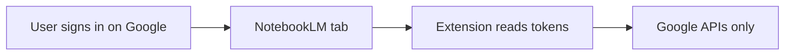

# Security in NotebookLM Mega Uploader

This document explains how the extension handles security and privacy. Use it for interviews, code reviews, Chrome Web Store disclosure, or onboarding.

---

## One-line answer

> The extension has no backend of its own. It reuses the user's existing Google session, keeps file processing local, sends data only to official Google endpoints, never persists credentials, and sanitizes logs and error messages so tokens don't leak.

---

## 30-second summary

1. **Trust model** — Extension piggybacks on Google's session; no passwords, no backend.
2. **Data flow** — Process locally, upload only to Google.
3. **Credential handling** — Tokens in memory only, refreshed from tab, never persisted.
4. **Leak prevention** — Log redaction and sanitized user-facing errors.
5. **Trade-offs** — Broad Google permissions and IndexedDB resume storage are conscious choices documented below.

---

## Security pillars

### 1. No custom auth — no password storage

We never ask for or store Google passwords. Authentication is delegated entirely to Google's normal sign-in in the browser.

**How it works:**

- User signs in at [notebooklm.google.com](https://notebooklm.google.com) like any other Google product.
- The extension reads short-lived page tokens (`SNlM0e` CSRF, `FdrFJe` session ID) from `WIZ_global_data` via `lib/tab-session.ts` and `lib/auth.ts`.
- No login form, no API keys, no `.env` secrets.

---

### 2. Credentials are ephemeral — not persisted

Session tokens live in memory for the duration of an operation. We do not write them to IndexedDB, `chrome.storage`, or `localStorage`.

| What | Where |
|------|-------|
| `AuthSession` (csrf, sessionId, tabId) | In-memory only, passed to `rpc.ts` / `upload.ts` |
| `fetchAuthSession()` | Called fresh on Connect and at upload start |
| `withFreshTabSession()` | Re-reads tokens from tab before each RPC (CSRF expires) |
| IndexedDB (`lib/chunk-store.ts`) | Upload blobs and job metadata only — **not** cookies or tokens |

---

### 3. Tab-proxy design — minimal cookie exposure

Chrome MV3 side panels cannot reliably use HttpOnly session cookies for cross-origin API calls. Instead of copying cookies into extension storage, we proxy requests through a content script running inside the signed-in NotebookLM tab.

| Approach | Risk |
|----------|------|
| Store cookies in extension storage | Long-lived secret on disk; larger blast radius if extension is compromised |
| **Tab proxy (this extension)** | Cookies stay in the browser's normal cookie jar; `fetch(..., credentials: 'include')` in tab origin |

**Key files:**

- `entrypoints/notebooklm.content.ts` — `NLM_FETCH` with `credentials: 'include'`
- `lib/tab-proxy.ts` — only targets tabs matching `isNotebookLmUrl()`
- `lib/rpc.ts` — prefers `tabId` path over manual `Cookie:` header

---

### 4. Data stays local until upload — no third-party servers

File splitting, compression, and FFmpeg processing run entirely in the browser via WASM. The extension has no backend. Network traffic goes only to official `notebooklm.google.com` endpoints.

| Stage | Location |
|-------|----------|
| Video prep | `lib/video/ffmpeg.ts` (local WASM) |
| Chunking | `lib/chunker.ts` |
| RPC / upload targets | Hardcoded in `lib/constants.ts` (`BATCHEXECUTE_URL`, `UPLOAD_URL`) |

**Important clarification:** "No third-party servers" means no extension-owned server. Uploaded content still goes to **Google NotebookLM** — the same destination as using the official website.

---

### 5. Defense against secret leakage in logs and UI

Internal errors can contain CSRF tokens, cookie headers, or raw API responses. We redact those before logging and map errors to user-friendly messages before showing them in the UI.

**`lib/logger.ts`:**

- Redacts keys matching `csrf|session|cookie|token|password|secret`
- `sessionLogContext()` logs `hasCsrf: true` and token **lengths** — never full values

**`lib/user-errors.ts`:**

- Blocks messages containing `cookie`, `csrf`, `batchexecute`, `sessionId` from reaching the UI
- Maps technical failures to actionable text ("Refresh the NotebookLM tab")

---

### 6. Input validation and least-scope file handling

We validate file types and sizes before processing and only accept known extensions.

**`lib/chunker.ts`:** `SUPPORTED_EXTENSIONS`, 2 GB max input, separate video vs document handling.

---

### 7. Extension permissions (with caveats)

We request only what Chrome needs for tab access, cookie reads, scripting, and the side panel.

From `wxt.config.ts`:

| Permission | Purpose |
|------------|---------|
| `tabs` + `scripting` | Find NotebookLM tab, inject content-script bridge |
| `cookies` | Fallback auth when tab tokens unavailable |
| `sidePanel` | UI |
| `contextMenus` | Right-click import on pages and links |
| `activeTab` | Temporary access to scrape visible page text on user action |
| `host_permissions` | `notebooklm.google.com` + `*.google.com` for Google upload/RPC endpoints |

**CSP on extension pages:** `script-src 'self' 'wasm-unsafe-eval'` — WASM required for FFmpeg; no remote scripts loaded.

---

## Threat model

| Threat | Mitigation | Residual risk |
|--------|------------|---------------|
| Credential theft via extension storage | Tokens never persisted; tab-proxy avoids copying cookies to disk | Tokens briefly in extension memory during operations |
| Secret leakage in logs/UI | `logger.ts` redaction; `user-errors.ts` sanitization | Raw errors may appear in dev console before mapping |
| Data sent to attacker server | All endpoints hardcoded to Google; no telemetry | Scotty upload URL from Google handshake is not re-validated by domain |
| Malicious page hijacking extension | Content script scoped to NotebookLM URLs only | `NLM_FETCH` trusts extension callers to pass safe URLs |
| Compromised extension package | Open source, auditable; no external backend | Same trust model as any extension with `host_permissions` + `cookies` |
| Sensitive files on disk | IndexedDB cleared on Done | Chunks stored unencrypted in browser profile until user clicks Done |
| XSS on NotebookLM page | MAIN-world script reads `WIZ_global_data` only | Trusts page integrity (same as official site) |
| Session expiry mid-upload | `withFreshTabSession()` refreshes tokens; user prompted to refresh tab | Upload may fail if tab is closed |
| URL import SSRF | `validateImportUrl()` blocks non-http(s), localhost, private IPs | User can still import arbitrary public URLs (by design) |
| Page text scrape | `activeTab` limits scripting to user-invoked actions | Scraped text sent to Google via `ADD_SOURCE` RPC |

---

## Web page import

- **Import URL** uses the `ADD_SOURCE` RPC (`izAoDd`). Only the URL string is sent; Google fetches content server-side.
- **Import page text** runs `chrome.scripting.executeScript` on the active tab when the user clicks the button (`activeTab` permission). Extracted text is sent via the text variant of `ADD_SOURCE`.
- URLs are validated in `lib/url-import.ts`: http/https only; `chrome://`, `file://`, localhost, and private IPs are rejected.
- Pending imports from the context menu are stored in `chrome.storage.session` (not persisted across browser restarts).

---

## Common questions

**Where are user files stored?**

Locally in browser memory and IndexedDB as upload chunks until the user clicks **Done**. Then they are deleted from IndexedDB. Uploaded content lives in the user's Google NotebookLM account.

**Can the extension access my Gmail/Drive?**

The extension requests broad `*.google.com` host permission because Google's upload and RPC endpoints span multiple Google domains. The code only calls hardcoded NotebookLM/Scotty URLs — it does not browse arbitrary Google services. The permission scope is wider than ideal; behavior is constrained by code.

**What if someone compromises the extension?**

They could proxy requests through the user's open NotebookLM tab while the tab is open — the same trust model as any extension with `host_permissions` and `cookies`. Mitigations: no persistent credential storage, no external telemetry endpoint, open-source auditable code.

**How do you handle session expiry?**

Tokens are refreshed from the live tab before each RPC. Expired CSRF triggers a user-facing "refresh the NotebookLM tab" message — not a raw token error.

**Is IndexedDB encrypted?**

No. It is standard browser IndexedDB in the user's Chrome profile. Chunks are plaintext until the user clears them. This is a known trade-off for resume-after-reload; users should click **Done** after uploads.

**What does Import page text access?**

Only when you click the button, the extension reads visible text from the active tab via `activeTab`. That text is sent to NotebookLM as a source — not to any third-party server.

---

## Known limitations (honest trade-offs)

1. **Broad `*.google.com` permission** — needed for Scotty upload URLs and cookie fallback; narrower scoping would be a future hardening item.
2. **`ALLOWED_COOKIE_DOMAINS` in `constants.ts` is defined but not enforced** — cookie reads use hardcoded probe lists in `auth.ts` instead.
3. **Content script trusts extension messages** — `NLM_FETCH` does not re-validate URL domain inside the content script; safety relies on callers only passing Google URLs.
4. **No upload URL domain validation** — Scotty `x-goog-upload-url` from Google's handshake is used directly.
5. **Reverse-engineered private API** — risk is mainly account/ToS exposure, not traditional CVE surface.
6. **IndexedDB holds full file blobs unencrypted** — until the user clicks Done.

---

## Related documentation

- [README.md](README.md) — permissions table and privacy summary
- [IMPLEMENTATION.md](IMPLEMENTATION.md) — tab-proxy rationale and auth model
- [Archietecture.md](Archietecture.md) — security and privacy overview

---

*Last updated: June 2026*
